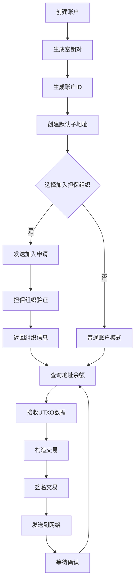

# UTXO 快速转账钱包 (TransferAreaInterface)

基于 UTXO 模型的新一代区块链钱包系统，提供安全可靠的数字资产管理体验。本项目包含 Go 语言后端参考实现和功能完整的纯前端 Web 应用。

[](https://golang.org/)
[](LICENSE)

---

## 📚 目录

- [项目概述](#-项目概述)
- [核心特性](#-核心特性)
- [技术架构](#-技术架构)
- [快速开始](#-快速开始)
- [业务流程](#-业务流程)
- [项目结构](#-项目结构)
- [API 文档](#-api-文档)
- [开发指南](#-开发指南)
- [更新日志](#-更新日志)
- [参考文档](#-参考文档)

---

## 🎯 项目概述

TransferAreaInterface 是基于 UTXO（Unspent Transaction Output）模型的区块链钱包系统，支持多币种管理、担保组织机制和跨链转账功能。

### 主要组成部分

1. **Go 后端参考实现** (`backend/`)  
   提供完整的账户管理、交易构造、签名验证等核心逻辑，作为前端实现的参考标准。

2. **纯前端 Web 应用** (`index.html`, `app.js`, `style.css`)  
   基于 WebCrypto API 的纯浏览器端钱包，无需后端即可完成密钥生成、交易签名等操作。

### 适用场景

- ✅ 学习 UTXO 模型和区块链钱包开发
- ✅ 构建去中心化钱包应用原型
- ✅ 理解担保组织机制和跨链转账流程
- ✅ 前后端密码学算法一致性验证

---

## ✨ 核心特性

### 🔐 安全性

- **本地密钥生成**：使用 ECDSA P-256 曲线，私钥永不上传
- **浏览器端加密**：基于 WebCrypto API 的安全密钥管理
- **多重签名**：交易签名、地址签名、UTXO 签名分离验证

### 💼 钱包功能

- **多币种支持**：PGC（盘古币）、BTC（比特币）、ETH（以太坊）
- **子地址管理**：一个账户下可创建多个子地址
- **UTXO 管理**：精确追踪每笔未花费输出
- **余额计算**：实时汇率转换，统一展示总资产

### 🌐 交易能力

- **普通转账**：支持多输入、多输出的灵活交易构造
- **跨链转账**：跨担保组织的资产转移
- **质押交易**：支持资产质押功能
- **Gas 费管理**：灵活的手续费分配机制

### 🏢 担保组织

- **组织加入/退出**：用户可申请加入指定担保组织
- **地址绑定**：子地址与担保组织关联
- **交易验证**：担保组织负责交易验证和上链

### 🎨 用户体验

- **现代化 UI**：玻璃态设计、流畅动画、深色模式
- **响应式布局**：适配桌面端和移动端
- **实时反馈**：加载状态、成功/错误提示、操作确认
- **数据可视化**：余额变化曲线、币种分布图表

---

## 🏗️ 技术架构

### 后端技术栈（Go）

```
Go 1.23
├── crypto/ecdsa       # ECDSA 签名算法
├── crypto/sha256      # SHA-256 哈希
├── encoding/json      # JSON 序列化
└── net/http           # HTTP 服务器（可选）
```

### 前端技术栈

```
纯前端实现
├── WebCrypto API      # 浏览器端密码学
├── HTML5 + CSS3       # 结构与样式
├── Vanilla JavaScript # 业务逻辑
├── Chart.js           # 数据可视化
└── LocalStorage       # 本地数据持久化
```

### 密码学规范

| 功能 | 算法 | 曲线 | 哈希 |
|------|------|------|------|
| 账户密钥对 | ECDSA | P-256 | SHA-256 |
| 子地址生成 | ECDSA | P-256 | SHA-256 |
| 交易签名 | ECDSA | P-256 | SHA-256 |
| 账户 ID | CRC32 | - | IEEE |

---

## 🚀 快速开始

### 前置要求

- **后端运行**：Go 1.23+
- **前端运行**：现代浏览器（Chrome/Edge/Firefox）支持 WebCrypto API

### 方式一：纯前端运行（推荐）

1. **启动本地静态服务器**

```bash
# 使用 Go 内置静态服务器
go run ./backend/cmd/webserver/main.go

# 或使用 Python（如已安装）
python -m http.server 8081

# 或使用 Node.js http-server（如已安装）
npx http-server -p 8081
```

2. **打开浏览器访问**

```
http://localhost:8081/
```

3. **开始使用**
   - 点击"立即开始"创建新账户
   - 或点击"已有账户？登录"导入已有私钥
   - 添加钱包地址后，可选择加入担保组织
   - 进入主页后即可进行转账操作

### 方式二：后端示例运行

后端代码提供了完整的业务流程示例，可用于测试和学习。

#### 测试示例代码

在项目根目录创建测试文件 `main.go`（参考 README 中的示例）：

```go
package main

import "fmt"

func main() {
    fmt.Println("开始运行示例程序...")
    
    // 第一步：新建用户
    account, err := NewUser()
    if err != nil {
        panic(err)
    }
    fmt.Println("Account ID:", account.AccountID)
    
    // 第二步：申请加入担保组织
    err = account.JoinGuarGroup()
    if err != nil {
        panic(err)
    }
    
    // ... 更多步骤参考下方"业务流程"章节
}
```

运行示例：

```bash
go run main.go
```

---

## 📋 业务流程

### 完整业务流程图



### 详细步骤说明

#### 步骤 1：新建用户账户

**后端实现**：[`NewAccount.go`](backend/NewAccount.go)  
**前端实现**：`app.js` - `newUser()` 函数

```javascript
// 前端调用示例
const account = await newUser();
console.log('Account ID:', account.AccountID);
console.log('Address:', account.Wallet.AddressMsg);
```

**流程**：
1. 生成 ECDSA P-256 密钥对（账户主密钥）
2. 使用私钥 `d` 的 Hex 值计算 CRC32，映射为 8 位账户 ID
3. 自动创建一个默认子地址（货币类型 0 = PGC）
4. 本地存储账户信息

#### 步骤 2：加入担保组织

**后端实现**：[`JoinGroup.go`](backend/JoinGroup.go)  
**前端实现**：`app.js` - 加入担保组织页面

```javascript
// 前端调用示例
const flowMsg = {
    Status: 1,  // 1=加入，0=退出
    UserID: account.AccountID,
    GuarGroupID: "10000000",  // 目标担保组织 ID
    AddressMsg: account.Wallet.AddressMsg,
    TimeStamp: Date.now()
};
// 使用账户私钥签名
flowMsg.UserSig = await signStruct(flowMsg, account.AccountPrivateKey);
// 发送到 RPC 节点
```

**流程**：
1. 构造 `UserFlowMsg` 结构体
2. 填入用户 ID、担保组织 ID、账户公钥
3. 遍历所有子地址，附带公钥信息
4. 使用账户私钥签名
5. 发送到目标担保组织 RPC 节点
6. 接收回执 `UserFlowMsgReply`，更新本地组织信息

#### 步骤 3：查询地址余额

**后端实现**：[`GetAddressMsg.go`](backend/GetAddressMsg.go)  
**前端实现**：`app.js` - 钱包主页自动刷新

```javascript
// 前端调用示例
const msg = {
    Address: Object.keys(account.Wallet.AddressMsg),
    Random: Math.floor(Math.random() * 1000001)
};
// 发送查询请求到 RPC
const result = await queryAddressMsg(msg);
// 处理返回的 UTXO 数据
account.ReceiveAddressMsg(result);
```

**流程**：
1. 构造 `GetNodeAddressMsg`，包含所有子地址列表
2. 发送到担保组织 RPC 节点
3. 接收 `ReturnNodeAddressMsg`，包含每个地址的：
   - UTXO 列表（未花费输出）
   - 余额总额
   - 预估利息
   - 最新区块高度
4. 更新本地钱包数据

#### 步骤 4：构造并发送交易

**后端实现**：[`SendTX.go`](backend/SendTX.go)  
**前端实现**：`app.js` - 转账页面

```javascript
// 前端调用示例
const buildTXInfo = {
    Value: 10,  // 总金额（汇率转换后）
    ValueDivision: { 0: 10 },  // 币种分配（0=PGC）
    Bill: {
        "目标地址": {
            MoneyType: 0,
            Value: 10,
            GuarGroupID: "10000000",
            PublicKey: 目标公钥,
            ToInterest: 0
        }
    },
    UserAddress: ["来源地址"],
    ChangeAddress: { 0: "找零地址" },
    InterestAssign: {
        Gas: 0,
        Output: 0,
        BackAssign: { "来源地址": 1 }
    }
};

// 构造交易
const tx = await account.BuildNewTX(buildTXInfo);
// 发送交易
await account.SendTX(tx);
```

**流程**：
1. 收集转账信息（目标地址、金额、币种）
2. 选择足够的 UTXO 作为输入
3. 构造输出（转账 + 找零）
4. 分配利息（Gas 费 + 输出利息 + 回退利息）
5. 计算交易哈希
6. 使用来源地址私钥签名每个输入
7. 使用账户私钥签名整个交易
8. 发送到担保组织
9. 本地更新 UTXO 列表（标记已使用）

#### 步骤 5：验证交易上链

重复**步骤 3**，查询地址余额变化，确认交易已被打包到区块中。

---

## 📁 项目结构

```
TransferAreaInterface/
├── backend/                    # Go 后端参考实现
│   ├── Account.go             # 账户结构体定义
│   ├── NewAccount.go          # 新建账户功能
│   ├── JoinGroup.go           # 加入担保组织
│   ├── GetAddressMsg.go       # 查询地址信息
│   ├── SendTX.go              # 交易构造与发送
│   ├── Transaction.go         # 交易结构体
│   ├── UTXO.go                # UTXO 数据结构
│   ├── TXCer.go               # 交易凭证
│   ├── core.go                # 核心工具函数
│   ├── cmd/
│   │   └── webserver/         # 静态文件服务器
│   │       └── main.go
│   └── verify_tx/             # 交易验证测试
│
├── css/                        # 模块化样式文件
│   ├── base.css               # 基础样式
│   ├── animations.css         # 动画效果
│   ├── components.css         # 通用组件
│   ├── header.css             # 头部导航
│   ├── welcome.css            # 首页欢迎页
│   ├── login.css              # 登录页
│   ├── new-user.css           # 新建账户页
│   ├── entry.css              # 钱包入口页
│   ├── wallet.css             # 钱包主页
│   ├── transaction.css        # 转账页
│   ├── import-wallet.css      # 导入钱包页
│   └── join-group.css         # 加入组织页
│
├── assets/                     # 静态资源
│   └── (图标、Logo等)
│
├── index.html                  # 主 HTML 文件
├── app.js                      # 前端业务逻辑（5000+ 行）
├── style.css                   # 主样式文件
├── wallet_struct_styles.css    # 钱包结构样式
├── go.mod                      # Go 模块定义
└── README.md                   # 本文档
```

### 核心文件说明

#### 后端核心文件

| 文件 | 功能 | 关键函数 |
|------|------|----------|
| `Account.go` | 账户与钱包结构体 | `GenerateKeyPair()`, `GenerateAddress()`, `NewSubAddress()` |
| `NewAccount.go` | 新建账户 | `NewUser()` |
| `JoinGroup.go` | 担保组织流程 | `JoinGuarGroup()`, `ReceiveJoinReply()` |
| `GetAddressMsg.go` | 地址查询 | `GetAddressMsg()`, `ReceiveAddressMsg()` |
| `SendTX.go` | 交易构造 | `BuildNewTX()`, `SendTX()` |
| `Transaction.go` | 交易签名 | `GetTXHash()`, `GetTXUserSignature()` |

#### 前端核心函数

| 函数 | 功能 | 位置 |
|------|------|------|
| `newUser()` | 生成新账户 | `app.js:623` |
| `BuildNewTX()` | 构造交易 | `app.js:2800+` |
| `getTXHash()` | 计算交易哈希 | `app.js:3500+` |
| `getTXUserSignature()` | 交易签名 | `app.js:3600+` |
| `saveUser()` / `loadUser()` | 本地存储 | `app.js:345/185` |

---

## 📖 API 文档

### 数据结构定义

#### Account（账户）

```go
type Account struct {
    AccountID         string             // 8 位数字用户 ID
    Wallet            Wallet             // 钱包信息
    GuarantorGroupID  string             // 担保组织 ID
    GuarGroupBootMsg  GuarGroupTable     // 担保组织通信信息
    AccountPublicKey  ecdsa.PublicKey    // 账户公钥
    AccountPrivateKey ecdsa.PrivateKey   // 账户私钥
}
```

#### Wallet（钱包）

```go
type Wallet struct {
    AddressMsg    map[string]AddressData   // 子地址映射
    TotalTXCers   map[string]TxCertificate // 交易凭证
    TotalValue    float64                  // 总余额（汇率转换后）
    ValueDivision map[int]float64          // 币种分布（0=PGC, 1=BTC, 2=ETH）
    UpdateTime    uint64                   // 最后更新时间戳
    UpdateBlock   int                      // 最后更新区块高度
}
```

#### AddressData（子地址）

```go
type AddressData struct {
    WPublicKey  ecdsa.PublicKey           // 子地址公钥
    WPrivateKey ecdsa.PrivateKey          // 子地址私钥
    Type        int                       // 币种类型
    UTXO        map[string]UTXOData       // UTXO 集合
    Value       Value                     // 余额详情
    EstInterest float64                   // 预估利息
}
```

#### Transaction（交易）

```go
type Transaction struct {
    TXID              string               // 交易 ID
    Size              int                  // 交易大小
    Version           float32              // 版本号
    GuarantorGroup    string               // 担保组织 ID
    TXType            int                  // 交易类型（0=普通 6=跨链 -1=质押）
    Value             float64              // 总金额
    ValueDivision     map[int]float64      // 币种分配
    InterestAssign    InterestAssign       // 利息分配
    UserSignature     EcdsaSignature       // 用户签名
    TXInputsNormal    []TXInputNormal      // 常规输入
    TXOutputs         []TXOutput           // 输出
    Data              []byte               // 额外数据（跨链用）
}
```

### 前后端接口对应

| 功能 | 后端函数 | 前端函数 | HTTP 接口（如有） |
|------|----------|----------|-------------------|
| 新建账户 | `NewUser()` | `newUser()` | `POST /api/account/new` |
| 加入担保组织 | `JoinGuarGroup()` | 加入组织页面逻辑 | `POST /api/group/join` |
| 查询余额 | `GetAddressMsg()` | 钱包页自动查询 | `POST /api/address/query` |
| 构造交易 | `BuildNewTX()` | `BuildNewTX()` | - |
| 发送交易 | `SendTX()` | `SendTX()` | `POST /api/transaction/send` |

---

## 🛠️ 开发指南

### 本地开发环境搭建

#### 1. 克隆项目

```bash
git clone https://github.com/yourusername/TransferAreaInterface.git
cd TransferAreaInterface
```

#### 2. 安装 Go 依赖（如需运行后端）

```bash
go mod tidy
```

#### 3. 启动开发服务器

```bash
# 方式 1：使用项目内置服务器
go run ./backend/cmd/webserver/main.go

# 方式 2：使用 Python
python -m http.server 8081

# 方式 3：使用 VS Code Live Server 插件
# 右键 index.html -> Open with Live Server
```

#### 4. 访问应用

打开浏览器访问 `http://localhost:8081`

### 前端开发要点

#### 密钥生成（与 Go 保持一致）

```javascript
// 生成 P-256 密钥对
async function generateKeyPair() {
    const keyPair = await window.crypto.subtle.generateKey(
        { name: "ECDSA", namedCurve: "P-256" },
        true,  // extractable
        ["sign", "verify"]
    );
    
    // 导出私钥 d 值
    const jwk = await window.crypto.subtle.exportKey("jwk", keyPair.privateKey);
    const dHex = base64urlToHex(jwk.d);
    
    // 导出公钥 X, Y 值
    const publicJwk = await window.crypto.subtle.exportKey("jwk", keyPair.publicKey);
    const publicKeyX = base64urlToHex(publicJwk.x);
    const publicKeyY = base64urlToHex(publicJwk.y);
    
    return { privateKey: dHex, publicKeyX, publicKeyY };
}
```

#### 地址生成

```javascript
// 未压缩公钥格式：0x04 || X || Y
const pubKeyBytes = hexToBytes("04" + publicKeyX + publicKeyY);
// SHA-256 哈希
const hash = await crypto.subtle.digest("SHA-256", pubKeyBytes);
// 取前 20 字节作为地址
const address = bytesToHex(new Uint8Array(hash).slice(0, 20));
```

#### 交易签名

```javascript
// 1. 计算交易哈希
const txHash = await getTXHash(transaction);

// 2. 使用私钥签名
const signature = await window.crypto.subtle.sign(
    { name: "ECDSA", hash: { name: "SHA-256" } },
    privateKeyObject,
    hexToBytes(txHash)
);

// 3. 提取 r, s 值
const sig = new Uint8Array(signature);
const r = bytesToHex(sig.slice(0, 32));
const s = bytesToHex(sig.slice(32, 64));
```

### 后端开发要点

#### 添加新的 RPC 接口

1. 在 `backend/cmd/webserver/main.go` 添加路由：

```go
http.HandleFunc("/api/your-endpoint", yourHandler)
```

2. 实现处理函数：

```go
func yourHandler(w http.ResponseWriter, r *http.Request) {
    // 解析请求
    var req YourRequestStruct
    json.NewDecoder(r.Body).Decode(&req)
    
    // 业务逻辑
    result := processYourLogic(req)
    
    // 返回响应
    w.Header().Set("Content-Type", "application/json")
    json.NewEncoder(w).Encode(result)
}
```

#### 添加新的交易类型

1. 在 `backend/Transaction.go` 定义 TXType 常量
2. 在 `backend/SendTX.go` 的 `BuildNewTX` 中添加验证逻辑
3. 更新前端 `app.js` 对应的交易构造函数

### 测试建议

#### 单元测试（后端）

```go
// backend/NewAccount_test.go
func TestNewUser(t *testing.T) {
    account, err := NewUser()
    if err != nil {
        t.Fatal(err)
    }
    if account.AccountID == "" {
        t.Error("AccountID should not be empty")
    }
}
```

#### 前端测试

```javascript
// 在浏览器控制台测试
async function testNewUser() {
    const account = await newUser();
    console.assert(account.AccountID.length === 8, "AccountID should be 8 digits");
    console.assert(Object.keys(account.Wallet.AddressMsg).length > 0, "Should have default address");
}
testNewUser();
```

---

## 📝 更新日志

### 最近重要更新

#### v2.5.0 - 2025-12-01

- ✅ **担保组织交互完善**
  - 注册/导入/入口"下一步"统一跳转到加入担保组织页
  - 菜单组织号实时同步，加入/退出自动刷新
  - 退出流程优化，展示 2秒 加载动画后清理状态
  - 空态动效与点击优化，流光层不拦截点击

#### v2.4.0 - 2025-11-30

- ✅ **钱包转账页重构**
  - 新增完整转账表单（来源地址、账单网格、找零按币种）
  - 自定义币种下拉统一风格，加入 PGC/BTC/ETH Logo
  - 账单默认一条，删除最后一条自动禁用且悬停提示
  - "添加一笔"按钮与删除按钮视觉统一为长条形

#### v2.3.0 - 2025-11-29

- ✅ **钱包主页优化**
  - 新增"正在连接"加载页与"账户与担保组织信息"页
  - 将"快速转账"和"跨链转账"合并为同一功能面板
  - 主页右侧新增担保组织详情信息展示
  - 修复入口"下一步"禁用条件与卡片串场问题

#### v2.2.0 - 2025-11-28

- ✅ **首屏与入口重构**
  - 新增登录/注册与"生成或导入钱包"页
  - 地址列表支持折叠、来源标识与贴身删除确认
  - 导入页自动清空输入并校验重复地址
  - 统一等待覆盖层与反馈弹窗

#### v2.1.0 - 2025-11-27

- ✅ **前端签名算法修复**
  - 修复前端交易签名与后端不一致问题
  - 统一 JSON 序列化规则（字段顺序、Map 键排序）
  - 修复 `GetTXHash` 和 `GetTXUserSignature` 实现

#### v2.0.0 - 2025-11-25

- ✅ **UTXO 管理逻辑更新**
  - "Add"余额按钮正确构造 `SubATX` 和 `UTXOData`
  - "Clear"余额按钮重置 `utxos` map
  - 修复余额计算和 UI 展示问题

#### v1.5.0 - 2025-11-24

- ✅ **钱包 UI 布局优化**
  - 增大"总余额"展示区域
  - 修复个别币种余额不更新 Bug
  - 移除子地址曲线图，仅保留总余额图表

### 历史版本

- **v1.0.0** - 初始版本，实现基础钱包功能
- **v1.1.0** - 新增担保组织支持
- **v1.2.0** - 新增跨链转账功能
- **v1.3.0** - 前端 UI 全面重构
- **v1.4.0** - 新增纯前端密钥生成

---

## 🔗 参考文档

### 官方文档

- **飞书文档**：[项目详细设计文档](https://w1yz69fcks.feishu.cn/docx/PPrtdA6mHoN5dlxkCDDcg9OJnZc)

### 技术参考

- [ECDSA - 椭圆曲线数字签名算法](https://en.wikipedia.org/wiki/Elliptic_Curve_Digital_Signature_Algorithm)
- [UTXO 模型介绍](https://en.bitcoin.it/wiki/Transaction#Input)
- [WebCrypto API - MDN](https://developer.mozilla.org/en-US/docs/Web/API/Web_Crypto_API)
- [P-256 曲线规范 (NIST)](https://csrc.nist.gov/publications/detail/fips/186/4/final)

### 示例数据

测试账户（可用于前端导入）：

```
Account 1:
  Address:     299954ff8bbd78eda3a686abcf86732cd18533af
  Group:       10000000
  PublicKey X: 2b9edf25237d23a753ea8774ffbfb1b6d6bbbc2c96209d41ee59089528eb1566
  PublicKey Y: c295d31bfd805e18b212fbbb726fc29a1bfc0762523789be70a2a1b737e63a80

Account 2:
  Address:     d76ec4020140d58c35e999a730bea07bf74a7763
  Group:       None
  PublicKey X: 11970dd5a7c3f6a131e24e8f066416941d79a177579c63d889ef9ce90ffd9ca8
  PublicKey Y: 037d81e8fb19883cc9e5ed8ebcc2b75e1696880c75a864099bec10a5821f69e0
```

---

## 📄 许可证

本项目采用 MIT 许可证。详见 [LICENSE](LICENSE) 文件。

---

## 🤝 贡献指南

欢迎提交 Issue 和 Pull Request！

1. Fork 本项目
2. 创建特性分支 (`git checkout -b feature/AmazingFeature`)
3. 提交更改 (`git commit -m 'Add some AmazingFeature'`)
4. 推送到分支 (`git push origin feature/AmazingFeature`)
5. 开启 Pull Request

---

## 📧 联系方式

如有问题或建议，请通过以下方式联系：

- 飞书文档：[项目讨论区](https://w1yz69fcks.feishu.cn/docx/PPrtdA6mHoN5dlxkCDDcg9OJnZc)
- GitHub Issues：[提交问题](https://github.com/yourusername/TransferAreaInterface/issues)

---

**祝您使用愉快！🎉**
